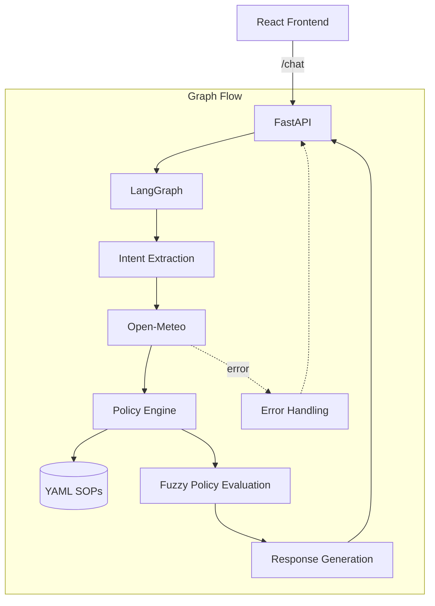

# Weather-Advisory Support Bot

**🚀 Live Demo:** [View Deployed App on Render](https://weather-advisory-frontend-befd.onrender.com)

A support bot that provides outdoor activity safety advice. It is fully deployed on Render and combines live Open-Meteo weather data, YAML-defined Standard Operating Procedures (SOPs), deterministic policy evaluation, LangGraph orchestration, Groq-powered LLM reasoning/response generation, a FastAPI backend, and a React + TypeScript frontend.

## Architecture



## LangGraph Flow

The orchestration flow relies on LangGraph to provide structured branching instead of a linear LLM chain. This allows deterministic routing and error handling without depending on the LLM to write its own workflow dynamically.

```text
START
  |
extract_intent
  |
  +---- no weather required ----> generate_response
  |
  +---- weather required -------> fetch_weather
                                      |
                                      +---- error ---> handle_error
                                      |
                                      v
                              evaluate_policies
                                      |
                                      v
                              generate_response
                                      |
                                      v
                                     END
```

## Policy Engine

The application enforces rules strictly through a YAML-driven policy engine:
- SOPs are stored in `sops.yaml`.
- Numeric conditions (e.g., temperature > 35) are evaluated deterministically. Missing weather values do not evaluate as zero; they are treated as unavailable and do not falsely trigger alerts.
- Fuzzy/non-numeric conditions use structured LLM evaluation (e.g., subjective visibility for stargazing).
- SOP IDs and guidance text remain strictly controlled by the YAML configuration.
- The engine can return multiple matching SOPs, which are deterministically ordered by severity.
- A global severe-weather SOP (e.g., extreme rain) applies across all activities and overrides activity-specific rules.

**YAML SOP Example:**
```yaml
- id: sop_wind_cycling
  description: "Dangerous wind speeds for cycling."
  category: outdoor exercise
  severity: medium
  intent_keywords: ["cycle", "cycling", "bike", "biking"]
  conditions:
    type: numeric
    rules:
      - metric: "wind_speed_10m"
        operator: ">"
        value: 40.0
  guidance: "Wind speeds exceed 40 km/h. This is a safety risk for cycling."
```

## Weather Grounding

To prevent hallucinations:
- Weather data is exclusively sourced from the live Open-Meteo API.
- The LLM does not invent weather observations.
- Missing weather fields are explicitly represented as unavailable.
- API and geocoding failures are surfaced honestly to the user rather than guessed.
- All recommendations must be directly supported by matched SOPs.

## Session Memory

The conversation history and contextual state are maintained using a persistent `session_id`:

```text
session_id
     |
     v
LangGraph thread_id
     |
     v
MemorySaver/checkpointer
```
This architecture ensures that conversational context (like remembering the location across turns) is maintained for the same session while completely isolating concurrent but separate sessions.

## Setup Instructions

### Backend
1. Create and activate a Python virtual environment:
   ```powershell
   python -m venv backend\venv
   .\backend\venv\Scripts\Activate.ps1
   ```
2. Install dependencies:
   ```powershell
   pip install -r backend\requirements.txt
   ```
3. Configure the environment variable in `backend/.env` (use `.env.example` as a template):
   ```text
   GROQ_API_KEY=your_groq_api_key_here
   ```

### Frontend
1. Install Node modules:
   ```powershell
   cd frontend
   npm install
   ```
2. Ensure the API URL is configured in `frontend/.env`:
   ```text
   VITE_API_URL=http://localhost:8000
   ```

## Running the Application

**Backend:**
```powershell
.\backend\venv\Scripts\uvicorn backend.main:app --reload
```
(The backend runs on `http://localhost:8000`)

**Frontend:**
```powershell
cd frontend
npm run dev
```
(The frontend typically runs on `http://localhost:5173`)

## Testing

The backend tests run offline (using mocked APIs) and cover exact numeric boundaries, prompt structures, error fallbacks, and isolation logic.

Run the test suite from the project root:
```powershell
$env:PYTHONPATH='.'
.\backend\venv\Scripts\pytest backend\
```
**Current Verified Result:** 36 passed.

To verify the frontend production build:
```powershell
cd frontend
npm run build
```

## Limitations
- **LLM Variability:** While instructions strictly forbid hallucination and bypassing policies, the system inherently relies on the underlying Groq model to accurately classify intent and parse fuzzy conditions. Unseen adversarial input could yield unexpected responses.
- **API Drift:** The offline tests use mocked Open-Meteo schemas. Upstream structural changes to the real Open-Meteo API payload may cause runtime failures not caught by the tests.
